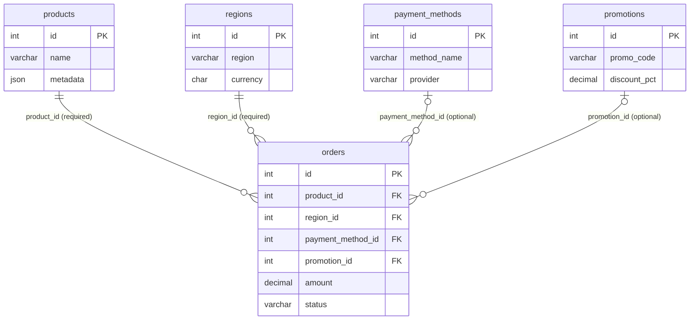
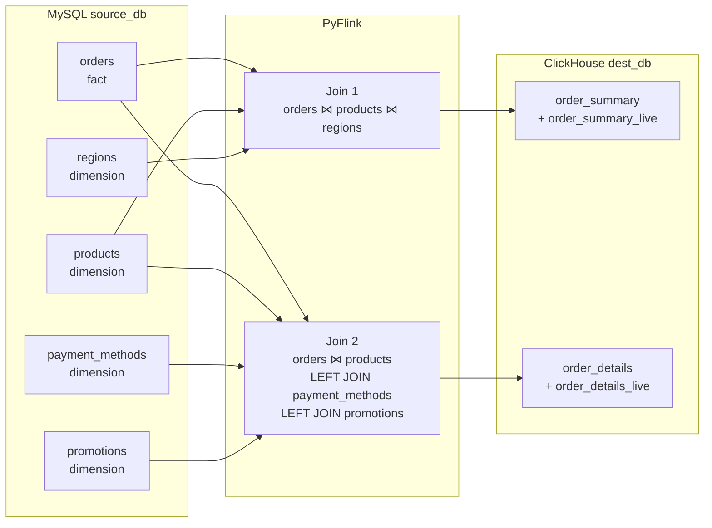

# MySQL → PyFlink → ClickHouse CDC Pipeline

Real-time change-data-capture pipeline that joins MySQL tables in PyFlink and
materialises denormalized views in ClickHouse. Any row change in **any** source
table propagates end-to-end in **< 2 seconds**.

---

## Architecture

```
MySQL (binlog)
    │
    ▼  Debezium (~300 ms)
Kafka  ──► cdc.source_db.<table>  (one topic per MySQL table)
    │
    ▼  PyFlink GenericJoinProcessor
    ├── Maintains state for every table (fact + dimensions)
    ├── Fact update   → re-join with latest dimension state → emit
    └── Dimension update → find all fact rows referencing it → re-emit all
    │
    ▼  HTTP JSONEachRow
ClickHouse  dest_db.<table>  (ReplacingMergeTree, dedupes by _version)
```

---

## ER Diagram

### MySQL (source_db)



### ClickHouse (dest_db) — pipeline data flow



> Each ClickHouse destination has a `_live` view that filters deleted rows
> (`_op != 'd'`) and returns only the latest version per key (`FINAL`).

---

## Prerequisites

- **Docker** and **Docker Compose** (v2)
- Ports **3306**, **8081**, **8083**, **8123**, **9000**, **9092** available
- ~4 GB RAM for all containers
- First run downloads and installs PyFlink inside Flink containers (~3 min)

---

## Quickstart

```bash
# 1. Start everything
./setup.sh

# 2. Trigger a change in MySQL
docker compose exec -T mysql mysql -u root -prootpass source_db -e \
  "UPDATE orders SET amount=999.99, status='shipped' WHERE id=1;"

# 3. Check ClickHouse within 2 seconds
docker compose exec -T clickhouse clickhouse-client \
  --query "SELECT * FROM dest_db.order_summary_live FORMAT Pretty"
```

---

## How joins are configured

All join topology is declared in **`config/pipelines.json`** — no code changes
needed to add new tables or new destination tables.

```json
{
  "pipelines": [
    {
      "name": "orders_to_order_summary",
      "destination": { "database": "dest_db", "table": "order_summary" },
      "fact": {
        "mysql_table": "orders",
        "columns": { "id": "order_id", "amount": "amount", "status": "status" }
      },
      "dimensions": [
        {
          "mysql_table": "products",
          "fk_in_fact": "product_id", "pk": "id",
          "columns": { "id": "product_id", "name": "product_name", "metadata": "product_metadata" }
        },
        {
          "mysql_table": "regions",
          "fk_in_fact": "region_id", "pk": "id",
          "columns": { "id": "region_id", "region": "region", "currency": "currency" }
        }
      ]
    }
  ]
}
```

### What triggers a re-emit

| Event                  | What happens                                                           |
|------------------------|------------------------------------------------------------------------|
| Fact row INSERT/UPDATE | Re-join with latest dimension state → emit one row to ClickHouse       |
| Fact row DELETE        | Emit row with `_op=d`; `_live` view filters it out                     |
| Dimension row change   | Find every fact row referencing it → re-emit all of them to ClickHouse |

### Pipeline config reference

| Field                    | Required | Description                                                   |
|--------------------------|----------|---------------------------------------------------------------|
| `name`                   | yes      | Unique pipeline identifier (for logging)                      |
| `destination.database`   | yes      | ClickHouse database                                           |
| `destination.table`      | yes      | ClickHouse table name                                         |
| `fact.mysql_table`       | yes      | MySQL fact table name                                         |
| `fact.columns`           | yes      | `{ mysql_col: clickhouse_col }` mapping for fact columns      |
| `dimensions[].mysql_table` | yes    | MySQL dimension table name                                    |
| `dimensions[].fk_in_fact`  | yes    | Foreign key column name in the fact table                     |
| `dimensions[].pk`          | yes    | Primary key column name in the dimension table                |
| `dimensions[].columns`     | yes    | `{ mysql_col: clickhouse_col }` mapping for dimension columns |
| `dimensions[].nullable`    | no     | Set `true` for LEFT JOIN dimensions (FK can be NULL)          |

---

## Adding more MySQL and ClickHouse tables

Three steps — no Python code changes needed.

### Step 1 — Create the MySQL source tables

Add tables to MySQL. Use nullable FK columns on the fact table for LEFT JOINs.

```sql
USE source_db;

CREATE TABLE payment_methods (
    id          INT         NOT NULL AUTO_INCREMENT,
    method_name VARCHAR(64) NOT NULL,
    provider    VARCHAR(64) NOT NULL DEFAULT 'internal',
    PRIMARY KEY (id)
);

-- Extend the existing fact table with nullable FKs
ALTER TABLE orders
    ADD COLUMN payment_method_id INT NULL;
```

### Step 2 — Create the ClickHouse destination table

Use `Nullable(...)` for columns from LEFT-joined dimensions.
Always include `_op`, `_version`, and `_ingested_at`.

```sql
CREATE TABLE dest_db.order_details (
    order_id          Int32,
    amount            Decimal(12, 2),
    status            LowCardinality(String),
    product_id        Int32,
    product_name      String,
    product_metadata  String,
    payment_method_id Nullable(Int32),
    payment_method    LowCardinality(String),
    payment_provider  LowCardinality(String),
    _op               LowCardinality(String),
    _version          UInt64,
    _ingested_at      DateTime DEFAULT now()
) ENGINE = ReplacingMergeTree(_version)
ORDER BY (order_id);

CREATE VIEW dest_db.order_details_live AS
SELECT * FROM dest_db.order_details FINAL WHERE _op != 'd';
```

### Step 3 — Register tables with Debezium and update pipelines.json

**3a.** Add the new MySQL tables to `config/debezium_connector.json`:

```json
"table.include.list": "source_db.orders,source_db.products,source_db.regions,source_db.payment_methods"
```

Then re-register the connector:

```bash
curl -X DELETE http://localhost:8083/connectors/mysql-cdc-source
curl -X POST http://localhost:8083/connectors \
  -H "Content-Type: application/json" \
  -d @config/debezium_connector.json
```

Kafka topics for the new tables are created automatically by Debezium.

**3b.** Add a new pipeline entry to `config/pipelines.json`.
For LEFT JOIN dimensions (nullable FK), add `"nullable": true`:

```json
{
  "name": "orders_to_order_details",
  "destination": { "database": "dest_db", "table": "order_details" },
  "fact": {
    "mysql_table": "orders",
    "columns": { "id": "order_id", "amount": "amount", "status": "status",
                 "payment_method_id": "payment_method_id" }
  },
  "dimensions": [
    {
      "mysql_table": "products",
      "fk_in_fact": "product_id", "pk": "id",
      "columns": { "id": "product_id", "name": "product_name", "metadata": "product_metadata" }
    },
    {
      "mysql_table": "payment_methods",
      "fk_in_fact": "payment_method_id", "pk": "id", "nullable": true,
      "columns": { "id": "payment_method_id", "method_name": "payment_method", "provider": "payment_provider" }
    }
  ]
}
```

**3c.** Redeploy the Flink job:

```bash
docker cp config/pipelines.json edl-flink-jobmanager-1:/opt/flink/jobs/pipelines.json
docker cp src/pipeline.py edl-flink-jobmanager-1:/opt/flink/jobs/pipeline.py
docker compose exec flink-jobmanager bash -c "pkill -f 'python3.*pipeline'; sleep 1"
docker compose exec -d flink-jobmanager bash -c \
  "python3 /opt/flink/jobs/pipeline.py > /tmp/pipeline.log 2>&1"
```

---

## Debezium DECIMAL encoding

Debezium encodes MySQL `DECIMAL` columns as **base64-encoded big-endian
integers**, scaled by 10^(scale). For example, `DECIMAL(12,2)` with value
`250.50` is encoded as `base64(25050)` → `"Ydo="`.

The pipeline decodes these automatically for columns listed in
`_DECIMAL_COLUMNS` inside `src/pipeline.py`. If you add a new DECIMAL column
to a dimension or fact table, add its MySQL column name to the set:

```python
_DECIMAL_COLUMNS = frozenset({
    "amount", "price", "total", "cost", "value", "discount_pct",
})
```

---

## Test cases

Run these to verify the pipeline end-to-end. Each test follows the same
pattern: make a MySQL change, wait up to 2 seconds, query ClickHouse.

```bash
# Helper aliases
CH='docker compose exec -T clickhouse clickhouse-client --query'
MY='docker compose exec -T mysql mysql -u root -prootpass source_db -e'
```

---

### order_summary tests (orders ⋈ products ⋈ regions)

#### Test 1 — Order INSERT

```bash
$MY "INSERT INTO orders (product_id, region_id, amount, status) VALUES (1, 1, 500.00, 'new');"
sleep 2
$CH "SELECT order_id, amount, status, product_name, region
     FROM dest_db.order_summary_live WHERE status='new' FORMAT Pretty"
```
**Expected:** new row with `amount=500.00`, `product_name` and `region` populated.

---

#### Test 2 — Order UPDATE

```bash
$MY "UPDATE orders SET amount=123.45, status='updated' WHERE id=1;"
sleep 2
$CH "SELECT order_id, amount, status FROM dest_db.order_summary_live WHERE order_id=1 FORMAT Pretty"
```
**Expected:** `order_id=1` shows `amount=123.45`, `status=updated`.

---

#### Test 3 — Product UPDATE cascades to all orders

```bash
$MY "UPDATE products SET name='NEW NAME' WHERE id=1;"
sleep 2
$CH "SELECT order_id, product_name FROM dest_db.order_summary_live WHERE product_id=1 FORMAT Pretty"
```
**Expected:** every order with `product_id=1` shows `product_name=NEW NAME`.

---

#### Test 4 — Region UPDATE cascades

```bash
$MY "UPDATE regions SET region='APAC', currency='SGD' WHERE id=2;"
sleep 2
$CH "SELECT order_id, region, currency FROM dest_db.order_summary_live WHERE region_id=2 FORMAT Pretty"
```
**Expected:** all orders with `region_id=2` show `region=APAC`, `currency=SGD`.

---

#### Test 5 — Order DELETE hidden from live view

```bash
$MY "DELETE FROM orders WHERE id=1;"
sleep 2
$CH "SELECT order_id FROM dest_db.order_summary_live WHERE order_id=1 FORMAT Pretty"
$CH "SELECT order_id, _op FROM dest_db.order_summary FINAL WHERE order_id=1 FORMAT Pretty"
```
**Expected:** live view returns no rows; raw table shows `_op=d`.

---

### order_details tests (orders ⋈ products LEFT JOIN payment_methods LEFT JOIN promotions)

#### Test 6 — INSERT with all dimensions present (full join)

```bash
$MY "INSERT INTO orders (product_id, region_id, payment_method_id, promotion_id, amount, status)
     VALUES (1, 1, 1, 1, 299.99, 'paid');"
sleep 2
$CH "SELECT order_id, amount, product_name, payment_method, payment_provider, promo_code, discount_pct
     FROM dest_db.order_details_live WHERE status='paid' FORMAT Pretty"
```
**Expected:** row with `product_name`, `payment_method=credit_card`,
`payment_provider=Stripe`, `promo_code=SAVE10`, `discount_pct=10.00`.

---

#### Test 7 — INSERT with NULL payment and promotion (LEFT JOIN returns NULL)

```bash
$MY "INSERT INTO orders (product_id, region_id, payment_method_id, promotion_id, amount, status)
     VALUES (2, 1, NULL, NULL, 49.99, 'no_extras');"
sleep 2
$CH "SELECT order_id, product_name, payment_method_id, payment_method, promotion_id, promo_code
     FROM dest_db.order_details_live WHERE status='no_extras' FORMAT Pretty"
```
**Expected:** `payment_method_id=NULL`, `payment_method=''`,
`promotion_id=NULL`, `promo_code=''` — row still appears (LEFT JOIN).

---

#### Test 8 — Assign a payment method to an order that had none

```bash
# Find an order without a payment method
$CH "SELECT order_id, payment_method_id FROM dest_db.order_details_live
     WHERE payment_method_id IS NULL LIMIT 1 FORMAT Pretty"

$MY "UPDATE orders SET payment_method_id=2 WHERE id=3;"
sleep 2
$CH "SELECT order_id, payment_method_id, payment_method, payment_provider
     FROM dest_db.order_details_live WHERE order_id=3 FORMAT Pretty"
```
**Expected:** `payment_method_id=2`, `payment_method=bank_transfer`, `payment_provider=Plaid`.

---

#### Test 9 — payment_methods UPDATE cascades to all referencing orders

```bash
$MY "UPDATE payment_methods SET method_name='debit_card', provider='Square' WHERE id=1;"
sleep 2
$CH "SELECT order_id, payment_method, payment_provider
     FROM dest_db.order_details_live WHERE payment_method_id=1 FORMAT Pretty"
```
**Expected:** all orders with `payment_method_id=1` show `payment_method=debit_card`, `payment_provider=Square`.

---

#### Test 10 — promotions UPDATE cascades

```bash
$MY "UPDATE promotions SET promo_code='SUMMER30', discount_pct=30.00 WHERE id=1;"
sleep 2
$CH "SELECT order_id, promo_code, discount_pct
     FROM dest_db.order_details_live WHERE promotion_id=1 FORMAT Pretty"
```
**Expected:** all orders with `promotion_id=1` show `promo_code=SUMMER30`, `discount_pct=30.00`.

---

#### Test 11 — Same order change updates both order_summary and order_details

```bash
$MY "UPDATE orders SET status='dual_check', amount=777.77 WHERE id=2;"
sleep 2
$CH "SELECT order_id, amount, status FROM dest_db.order_summary_live WHERE order_id=2 FORMAT Pretty"
$CH "SELECT order_id, amount, status FROM dest_db.order_details_live WHERE order_id=2 FORMAT Pretty"
```
**Expected:** both views show `amount=777.77`, `status=dual_check`.

---

### General tests

#### Test 12 — Latency check (end-to-end < 2 s)

```bash
START=$(date +%s%3N)
$MY "UPDATE orders SET status='latency_test' WHERE id=2;"

while true; do
  RESULT=$($CH "SELECT status FROM dest_db.order_summary_live
                WHERE order_id=2 AND status='latency_test'")
  if [ -n "$RESULT" ]; then
    END=$(date +%s%3N)
    echo "Latency: $((END - START)) ms"
    break
  fi
  sleep 0.1
done
```
**Expected:** prints a value under 2000 ms.

---

#### Test 13 — No duplicate rows after rapid updates

```bash
for i in 1 2 3 4 5; do
  $MY "UPDATE orders SET status='v$i' WHERE id=3;"
done
sleep 3
$CH "SELECT order_id, count() as cnt FROM dest_db.order_summary_live
     GROUP BY order_id HAVING cnt > 1 FORMAT Pretty"
$CH "SELECT order_id, count() as cnt FROM dest_db.order_details_live
     GROUP BY order_id HAVING cnt > 1 FORMAT Pretty"
```
**Expected:** empty result for both — no duplicates.

---

## Project layout

```
├── config/
│   ├── debezium_connector.json   # Debezium MySQL connector settings
│   └── pipelines.json            # Join topology — edit this to add new pipelines
├── sql/
│   ├── mysql_source.sql          # Source tables + seed data
│   └── clickhouse_dest.sql       # Destination tables + live views
├── src/
│   └── pipeline.py               # Generic PyFlink job (config-driven)
├── docker-compose.yml            # All services
├── setup.sh                      # One-command bootstrap
└── README.md
```

---

## Services

| Service          | Port  | Purpose                        |
|------------------|-------|--------------------------------|
| MySQL            | 3306  | Source database (binlog on)    |
| Kafka            | 9092  | Event bus                      |
| Debezium         | 8083  | Captures binlog → Kafka        |
| ClickHouse       | 8123  | Destination (HTTP API)         |
| ClickHouse       | 9000  | Destination (native protocol)  |
| Flink JobManager | 8081  | Job UI + submission            |

---

## Latency budget

| Stage                | Budget    |
|----------------------|-----------|
| Binlog → Debezium    | ~200 ms   |
| Debezium → Kafka     | ~100 ms   |
| Kafka → Flink        | ~100 ms   |
| Flink join + emit    | ~200 ms   |
| HTTP → ClickHouse    | ~100 ms   |
| **Total**            | **< 1 s** (2 s headroom) |

---

## Environment variables

| Variable             | Default                          | Description                     |
|----------------------|----------------------------------|---------------------------------|
| `KAFKA_BOOTSTRAP`    | `kafka:29092`                    | Kafka broker address            |
| `KAFKA_TOPIC_PREFIX` | `cdc.source_db`                  | Prefix for Debezium topic names |
| `CLICKHOUSE_URL`     | `http://clickhouse:8123`         | ClickHouse HTTP endpoint        |
| `CONFIG_PATH`        | `/opt/flink/jobs/pipelines.json` | Path to pipeline config         |
| `PARALLELISM`        | `1`                              | Flink job parallelism           |

---

## Troubleshooting

### Debezium connector not running

```bash
# Check connector status
curl -s http://localhost:8083/connectors/mysql-cdc-source/status | python3 -m json.tool

# Re-register the connector
curl -X DELETE http://localhost:8083/connectors/mysql-cdc-source
curl -X POST http://localhost:8083/connectors \
  -H "Content-Type: application/json" \
  -d @config/debezium_connector.json
```

### Flink pipeline not processing events

```bash
# Check if the pipeline process is running
docker compose exec flink-jobmanager bash -c "ps aux | grep pipeline"

# View pipeline logs
docker compose exec flink-jobmanager bash -c "cat /tmp/pipeline.log"

# Restart the pipeline
docker compose exec flink-jobmanager bash -c "pkill -f 'python3.*pipeline'; sleep 1"
docker compose exec -d flink-jobmanager bash -c \
  "python3 /opt/flink/jobs/pipeline.py > /tmp/pipeline.log 2>&1"
```

### Changes not appearing in ClickHouse

1. Verify Kafka topics have data:
   ```bash
   docker compose exec -T kafka kafka-console-consumer \
     --bootstrap-server localhost:9092 \
     --topic cdc.source_db.orders --from-beginning --max-messages 3 --timeout-ms 5000
   ```
2. Check if the Flink job is running (see above).
3. Verify ClickHouse tables exist:
   ```bash
   docker compose exec -T clickhouse clickhouse-client \
     --query "SHOW TABLES FROM dest_db"
   ```

### ClickHouse shows stale data after FINAL

`ReplacingMergeTree` deduplicates during background merges. The `_live` views
use `FINAL` to force deduplication at query time. If you query the raw table
without `FINAL`, you may see multiple versions of the same row.

### Full reset

```bash
docker compose down -v   # removes all data volumes
./setup.sh               # re-bootstrap from scratch
```
